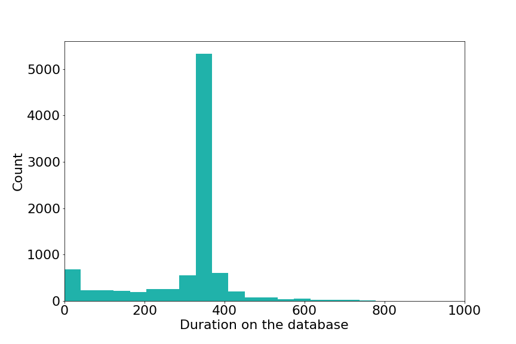
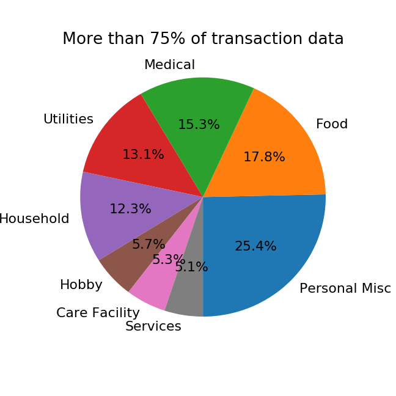
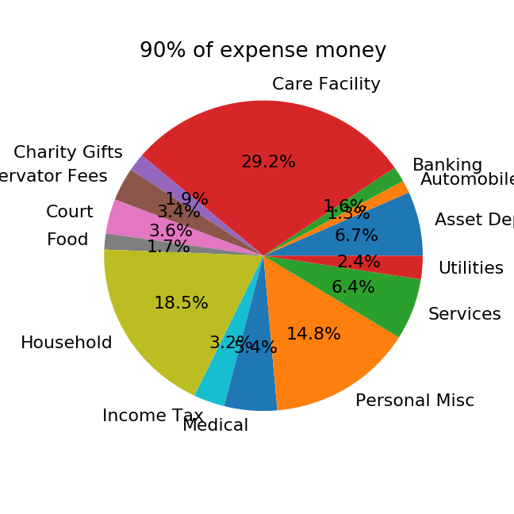
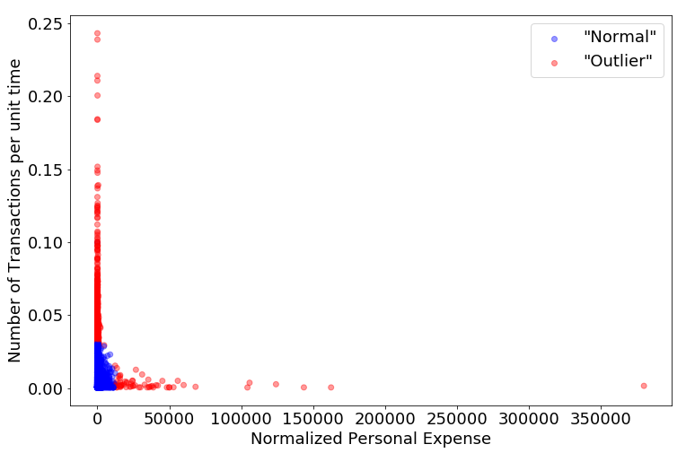

# Elderly Financial Exploitation Detection

## Background

When a person's cognitive abilities are compromised the court may appoint a conservator to handle their finances, make transactions on their behalf. In the US, Minnesota keeps a digital record of these transactions. The data for this project is a test set of data from the State of Minnesota, provided by Mr Michael Curran of [Guide Change](https://guidechange.com/). The idea is to identify people who may have been defrauded and find patterns from their data to help the vulnerable population.

These data are from the year 2012 to 2015; the number of people (taken care of) is 9125.

## Goal

The goal of this project is to understand the data, and using data-science techniques raise reasonable red flags. It may not be possible to get back to those particular cases, but the idea is to learn the pattern and alert authorities about how low-level cheating, frauds happen.

Previously, the state government used red flags like, if the charitable donations are over $100 or if a single cash transaction is over certain amount. This is not a very clever way to handle such a big and varied dataset and there are too many red flags. It is a waste of resources like accountants' time and in turn tax-payers' money.

The other part of the system is that the bureaucrats do not look into the cases for whom monthly income (Estate) is less than $3000. So it is important to find outliers within low-income people too.

Although some of these cases might be investigated in detail, there is no information about that in the dataset. Hence the challenging part of the project is that these are unlabeled data, and this is going to be unsupervised learning.

## Data

The data are provided by Michael Curran of Guide Change; the data in turn came from a test dataset the state of Minnesota provided for such analyses.

It is in MSSQL format. (If you are looking ways to read MSSQL tables in Python, find the jupyter notebook - DataPipeline.ipynb - within this project.)

The most important table for this project is - *IncomeExpenseTable*. The information used from this table has format :

| CaseFileID | Transaction Date | Amount | Transaction Category |
| ---------- | ---------------- | ------ | -------------------- |
| 22208      |  2014-10-27      | 7.36	 | 197 |

There are data for 9125 unique individuals (being taken care of by conservators or guardians); 56 unique categories for expenses; and 785478 expense transactions in all. Here is another way to look at the data -

Histogram of duration these individuals have spent on the database -

Here is another overview of transactions. Below are two pie-charts, first is of number of transactions-

And the next is the pie-chart of total dollar amount spent in each transaction category-

There are income transactions and a lot more redundant information in this table and other SQL tables too.

## Using the data or Feature Engineering

To begin with, this was the most difficult part of the project.

**A paragraph that only Data Scientist and Machine-Learning people would find interesting**

The was Data-Science, Machine-Learning is taught, we expect a nice, clean X or feature matrix to work with. That is irrespective of whether it is supervised or unsupervised learning. To make a feature matrix like that was a difficult job; how to select features to use, or how to condense information and yet lose nothing important was the challenge. The important lesson is - get hands dirty with data to learn something important.

**Description in English for anyone who is even mildly interested**

A simple idea to begin with -

Rather than dealing with 56 categories of expense, I used another SQL table for description of the expenses. Related expenses, for example - different utilities - gas-electricity, cable-phone-internet, water, sewage - were considered as just one type of expense.

The database has information about when the transaction was made. Since different people are on the database for different periods and different length of time, an idea to deal with time-series was dropped. But time information was used in another way.

There are two assumptions in feature engineering

1. The first one is people will spend similar amounts in a given amount of time -

  Of course, people who have more money will spend more money. But if each transaction is normalized with the total money they have spent in that category would give us a handle on spending patterns of people, irrespective of their wealth.

  While looking at the data, visually or mathematically, expense amounts were normalized.

2. The number of transactions will be similar for a given amount of time as well.

  If I were to commit fraud, I won't spend a b!@# load of money in a single transaction. That would certainly invite bureaucratic suspicion. But what if, say I spend 10 dollars every day or 100 dollars a week? That's a not big dollar amount and bureaucrats have no way of catching this kind of fraud (assuming that the goods or services bought using this money helps the conservator or guardian and not the person who owns the money).

  To catch that sort of transactions, I used another feature - number of transactions in a given length of time.

Using these two ideas, some plots were made. For example, here is a plot for Personal and Miscellaneous Expenses added together -

## Finding outliers

From the figure above, one can easily see some outliers. The colours would help too. But to suspect someone for fraud we need something more robust that looking at the plot. Also, there are big numbers on the X-axis (money spent) and small numbers on Y-axis (number of transactions). Also, it would be useful to use one same method on all sorts of people - rich, middle-class, poor, etc. That's desirable because if there is more data, it's easier to point outliers.

(This is just like looking at faint objects in the sky. Point a telescope at a faint object for a long time; that will increase signal-to-noise ratio.)

From the plot, it is obvious that a large number of people are close to origin of this plot and they are probably not being cheated for money. There is a big density of people in that region. An outlier - someone who doesn't have a lot of neighbours - is someone who is potentially being defrauded by their conservator.

#### Outlier Quantification

For each of the spending category, such plots (and data) were made. Outliers were detected in each category individually. To quantify that -

1. Distance between each pair of points (people) is measured; the space here is defined by the money they've spent in that category and the number of transactions they've made in that category.

2. A median distance is found from the calculation in step 1.

3. Number of points (individuals) within median distance were found.

4. People were ranked using the number of neighbours. The ranks were calculated as follows -
  * If there is no data for a person in that category, their rank is 0.
  * For the rest of the people, rank = 1 - number of neighbours/maximum number of neighbours in the category.

  This means lower the rank, lower is the probability of being defrauded.

5. Ranks from the expense categories were collected together. People who have high ranks in multiple categories are potentially being cheated more, than someone who is an outlier in only one or fewer categories.

Using this metric, collected_rank, we can quantify the worst outliers and the people slightly better off than them.

This plot above is similar to the one above. X-axis is total spending of person across all the categories; Y-axis is the total number of transactions, again across all categories. Red and green colours indicate rank across all spending categories. Half the people are considered outliers, or median rank is used to divide 'normal' from an 'outlier'.

**Interpretation of the plot**

1. Most of the green points are close to the origin; but some red points are bleeding into the green cloud. That means, these points/people were outliers in more than one category; so that even if they are in the 'normal spending pattern' area, they get labeled red.

2. The fact that there are a not a lot of red points close to X-axis implies that people who spend a lot of money in a single transaction are not outliers in (many) other categories; the algorithm is "liberal" to consider very few big-ticket spendings per person as necessary evils; but ...

3. ... there are quite a few red points close to Y-axis. That means these people spend not a whole lot of money (possibly because they don't have a lot of money), but spend it more regularly than others. This implies that the kind of algorithm used here to find outliers gives more importance to not-so-rich people's transactions.

This is indeed a big step, given that the government does not look into accounts where the value of a person's accounts (jargon - estate) is less than 3000 dollars.

## Getting back to the goal of the project

Now that we have a regular spending pattern, it can be used
  * to inform authorities about outliers; (they may or may not take this seriously)
  * to help people budget better

## Technologies used
* MSSQL (Microsoft SQL, Express 2012)
* Jupyter Notebook
* Python
  * sqlalchemy
  * pandas
  * matplotlib
  * numpy
  * datetime

## Thanks

* Michael Curran of Guide Change for suggesting the project and providing the data.
* Dr Scott Schwartz for very useful brainstorming.
* The State of Minnesota for providing the test dataset for analysis.
